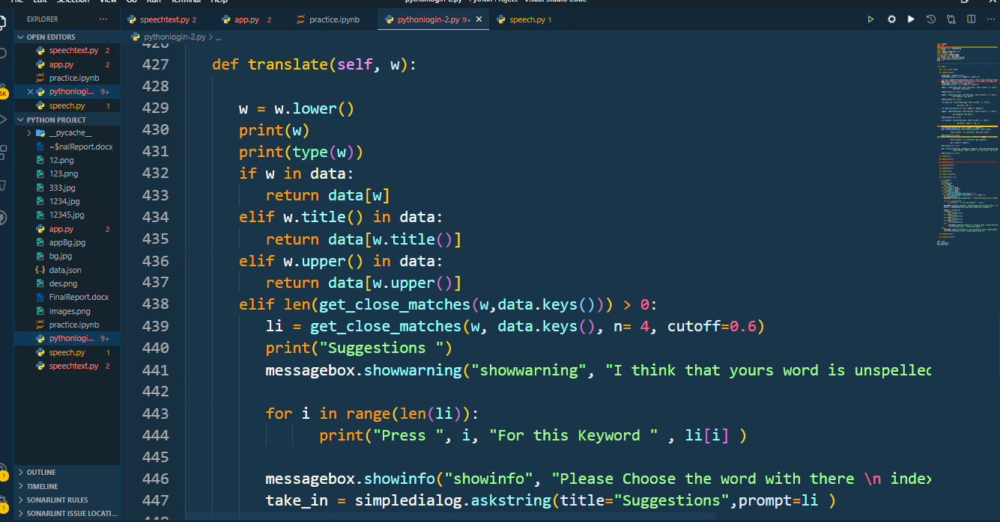

# Introduction

    
  Dictionary in Python is an unordered collection of data values, used to store data values like a map, which, unlike other Data Types that hold only a single value as an element, Dictionary holds the key: value pair. Key-value is provided in the dictionary to make it more optimized. Each key-value pair in a Dictionary is separated by a colon (:), whereas each key, is separated by a ‘comma’.
A Dictionary in Python works similarly to the Dictionary in the real world. The keys of a Dictionary must be unique and of immutable data types such as Strings, Integers, and tuples, but the key-values can be repeated and be of any type.


## Modules needed:

### json: 
  It comes built-in with python, so there is no need to install it externally.
### Difflib: 
This module provides classes and functions for comparing sequences. It also comes built-in with python so there is no need to install it externally.
### Speech Recognition:
 Library for performing speech recognition, with support for several engines and APIs, online and offline.
### Tkinter : 
is Python's de-facto standard GUI (Graphical User Interface) package. It is a thin object-oriented layer on top of Tcl/Tk. Tkinter is not the only GuiProgramming toolkit for Python.
.

```bash
## Tools:
: = >	Visual studio Code 
: = >	Pycharm
: = >	Jupitor Notebook

```



